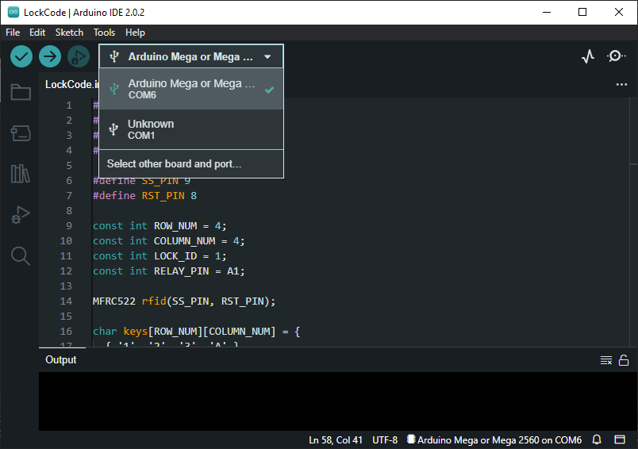
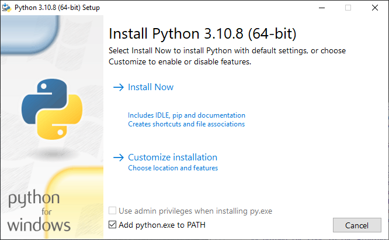
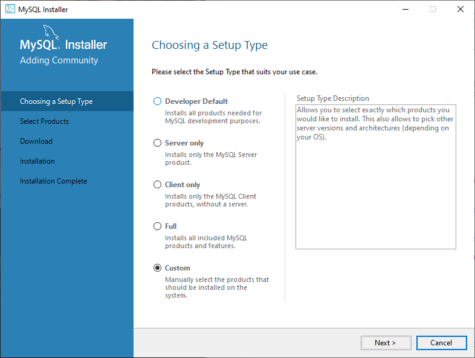
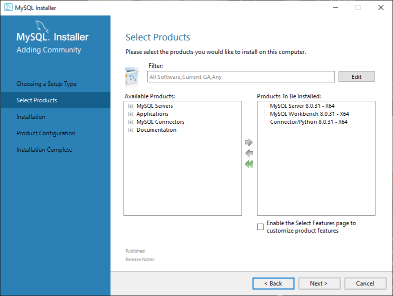

# EverEye Security Suite

## Overview

_**placeholder**_

## Experience Gained during Project

_**placeholder**_

---

## Requirements

### Hardware

_Note that this project assumes 2 lock units are present._ \
_All major functionalities can be performed with only one lock unit, but certain features will require 2._

* Lock Components

  * Arduino Mega or Clone

  * RFID Scanner

  * 4x4 Keypad

  * LCD I2C

  * Relay

  * 9-Volt Power Adaptor

  * Solenoid Lock

  * 15 Male-To-Male Jumper Wires

  * 11 Male-To-Female Jumper Wires

  * Solderless Breadboard _(The smaller, the better)_

  * _Optional_: Lock Unit Case

* Other Components

  * USB-To-Serial Cable

  * RFID Tag

  * Windows Computer

### Software

* Arduino IDE

* Python

  * Libraries:

    * MySQL Connector

    * pySerial

    * ZeroMQ

    * tkcalendar

    * Pillow

* MySQL Server

* _Optional_: Python-Compatable IDE

---

## Instructions

### Setting Up

### _Hardware_

1. Ensure that the following materials are on hand:

    * Arduino Mega

    * RFID Scanner

    * Keypad

    * LCD I2C Display

    * Relay

    * 9-Volt Power Adaptor

    * Solenoid Lock

    * Male-To-Male Jumper Wires

    * Male-To-Female Jumper Wires

    * Solderless Breadboard

2. Connect the RFID Scanner to the Arduino Meg

    * Take 7 Male-To-Female Jumper Wires

    * Insert the Female ends of the Wires into the RFID Scanner's pins

    * The IRQ connection will not be used; you do not have to attach a wire to that connector

    * It is recommended that a empty plug is placed on the IRQ pin so as to cover it from the elements

    * Plug in the Male ends of the wires into the Arduino in the following configuration:

      | RFID | Arduino |
      | :-: | :-: |
      | SDA | 9 |
      | SCK | 52 |
      | MOSI | 51 |
      | MISO | 50 |
      | IRQ | _N/A_ |
      | GND | GND |
      | RST | 8 |
      | 3.3V | 3.3V |

3. Connect in the Keypad to the Arduino Mega

    * Take 8 Male-To-Male Jumper Wires

    * Insert one end of the wires into the Keypad's plugs

    * Plug in the other end of the wires into the Arduino in the following configuration:

      | Keypad | Arduino |
      | :-: | :-: |
      | 1 | 49 |
      | 2 | 47 |
      | 3 | 45 |
      | 4 | 43 |
      | 5 | 41 |
      | 6 | 39 |
      | 7 | 37 |
      | 8 | 35 |

4. Connect the LCD I2C Display to the Arduino Mega

    * Take 4 Male-To-Female Jumper Wirers

    * Take 1 Breadboard

    * Plug in the Female ends of the Wires into the 4 I2C pins located on the back of the LCD Display

    * Connect the VCC wire into the Breadboard

    * Plug in the Male ends of the remaining Wires into the Arduino in the following configuration:

      | LCD I2C | Arduino |
      | :-: | :-: |
      | GND | GND |
      | SDA | 20 SDA |
      | SCL | 21 SCL |

5. Connect the Relay to the Arduino Mega

    * Take 5 Male-To-Male Jumper Wires

    * Loosen the Screws on the Relay's connections

    * Insert one end of the wires into the plugs on the relay

      * The NC Connection will not be used, therefore you do no have to plug in any connector

    * Tighten the screws to secure the connection

    * Insert the DC+ wire into the breadboard so as to connect it to the VCC wire from the LCD I2C Display

    * Insert the other ends of the remaining wires into the Arduino in the following configuration:

      | Relay | Arduino |
      | :-: | :-: |  
      | DC- | GND |
      | Out | A1 |

6. Connect the Breadboard to the Arduino Mega

    * Insert one end of a Male-To-Male jumper wire into the 5V port on the Arduino Mega

    * Insert the other end of the wire into the breadbox so that it is in series with the VCC and DC+ wires

7. Connect the 9V Adapter into the circuit

    * Loosen the Screws on the Adapter's connections

    * Insert the wire connected to the Relay's NO socket into the (-) socket of the Adapter

    * Take a Male-To-Male jumper wire and insert one end into the (+) socket of the Adapter

    * Tighten the screws to secure the connection

8. Connect the Solenoid Lock into the circuit

    * Insert the COM wire on the Relay into the Red Wire of the Solenoid Lock

    * Insert the (+) wire from the 9V Adapter into the Black Wire of the Solenoid Lock

### _Software_

1. Download the Contents of this Git Repository

2. Set up the Arduino Software

    * Download and Install the Arduino IDE

      * <https://www.arduino.cc/en/software>
  
      * Select Windows Win 10 and newer, 64 bits

      * Use the default settings on the installer, unless you wish to install the IDE in a specific location

    * Open up LockCode.ico in the Arduino IDE

    * Plug in the Arduino to your computer via the USB-Serial Cable

    * Select the plugged-in board from the drop-down menu

      

    * Note the name of the COM port

    * Upload the Code to the Arduino Mega

    * _Optional_: Upload the Code to the Second Arduino

3. Set up the Python Software

    * Download and Install Python Version 3.10

      * <https://www.python.org/downloads/release/python-3108>

      * The 64-bit Windows installer is recommended

    * At the set up page, check the "Add python.exe to PATH" option and click "Install Now"

      

    * Once Python has been successfully installed, open up the command prompt

    * In the command prompt,run the command "python -m pip list"; you should see a list of the currently installed Python packages if the installation was successful

    * If an new release of pip is available, run the indicated command

    * Run the following command to install the necessary Python packages: "python -m install pyserial zmq tkcalendar pillow

4. Set up the MySQL Software

    * Download and Install the MySQL Installer

      * <https://dev.mysql.com/downloads/installer>

    * Open MySQL Installer if it does not automatically open

    * When prompted to choose a setup type, select "Custom"

     

    * Select the following products to be installed

      * MySQL Server (Latest Edition)

      * MySQL Workbench (Latest Edition)

      * Connector/Python (Latest Edition)

     

    * Install the packages

    * When Configuring the MySQL Server, follow these instructions for each screen

      * Type and Networking: Leave as default

      * Authentication Method: Leave as Default

      * Accounts and Roles: Enter in a root password; this will be needed for later use

      * Windows Service: Leave as Default

      * Server File Permissions: Leave as Default

    * Click execute to set up the MySQL Server

5. Prepare the Database

    * Open up MySQL Workbench and connect to the newly installed server

    * Open up DatabaseSetUp.sql

    * Execute the Script

    * Close MySQL Workbench

6. Prepare the Python Code

    * Open up EverEyePassiveLock1.py in your editor of choice

    * In the definition connectToDatabase(), add in your chosen MySQL username and password

      * Lines 9 & 10

      * If you did not specify a username during setup, the username will be "root"

    * Move down to line 110 and type in the port name see in the Arduino IDE where indicated

    * Perform the same for EverEyePassiveLock2.py if you've assembled a second lock, making sure that the port name is for said lock and not the first unit

    * Open up EverEyeProgram.py in your editor of choice

    * In the definition connectToDatabase(), add in your chosen MySQL username and password

      * Lines 9 & 10

      * If you did not specify a username during setup, the username will be "root"

### Packaging

_**placeholder**_

### Running

_**placeholder**_

---

## Future Improvements

_**placeholder**_

## Authors

Designed by Alexander James Tolley

## Acknowledgments

* Advisors
  * Jason Isaacs
  * Reza Abdolee
* Freepik
