# ***EverEye Security Suite***

---

# Overview

The EverEye Security Suite is a combination of hardware and software that can secure physical locations and log entries into those locations into an external database. In order to access a  secured location, a authorized user must have a valid RFID key and its associated password. EverEye is comprised of 3 primary components, an Arduino-based physical lock unit, a MySQL database, and a number of Python programs that control the lock's connection to the database and allow an administrator access to the database.

The component that the majority of users will interact with the most is the physical lock unit. This unit is build around an Arduino Mega MicroController, which was chosen due to its abundance of connections. Connected to the Arduino are an RFID Scanner where a user will scan an RFID tag, a 4x4 Keypad where the user will enter in their password, an LCD I2C Display that will show information to the user about the current status of the lock unit, and the solenoid lock itself. Alongside the solenoid lock are a relay to handle signals and a 9V Adaptor with a plug attachment for power.

The database is built on MySQL and tracks two primary entities. The first entity is Users, which represent people that have been authorized to access the location secured by the security suite. The second entity is Logs, which represent any attempted entry that occurs at a lock unit. Additional entities tracked are the lock units themselves and the permissions that each user has in relation to each lock.

There are two Python-based programs that will be running on the connected computer. The first is the passive lock program that connects the lock unit to the database. This program must be actively running on the same system where the database is installed in order for the lock unit to function. There are two version of this program included; one for each lock.

The second program is a GUI program that allows a systems administrator to access and interact with the database. With this program, the administrator can add, edit, and delete users, access and export entry logs based on three filters (lock, user, and date), and open locks. The GUI program does not directly interact with any lock unit; it instead communicates with the passive program to perform actions related to the lock unit.

There is one more Python file included that runs both passive lock programs and the GUI program at once. It is there for convenience's sake.

# Experience Gained during Project

I have gained a lot of experience over the course of creating this project, both in fields that I've had prior knowledge in and fields that were new to me.

Experience in fields that I've had prior knowledge in include:

* Python
* C++
* Databases
  * MySQL
* Electronics Assembly
* GUI Design

Experience in fields that were either completely or relatively new to me include:

* MicroControllers
  * Arduino
* Serial Connections
* Socket Communication
* GUI Construction
  * TKinter

---

# Requirements

## Hardware

*Note that this project assumes 2 lock units are present.* \
*All major functionalities can be performed with only one lock unit, but certain features will require 2.*

* Lock Components

  * Arduino Mega MicroController or Clone

  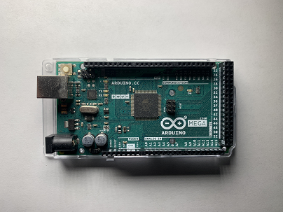

  * RFID Scanner

  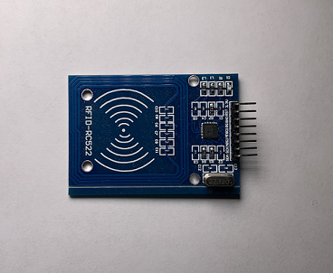

  * 4x4 Keypad

  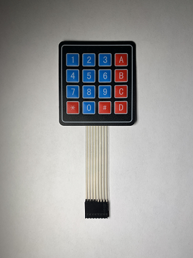

  * LCD I2C Display

  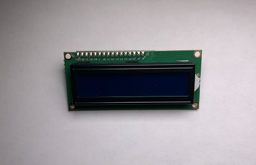

  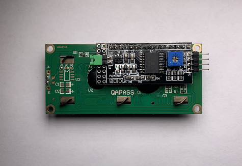

  * One-Channel Relay Module

  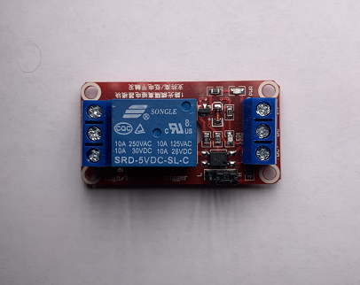

  * 9-Volt Power Adaptor with (+)(-) Plug Attachment

  

  * Solenoid Lock

  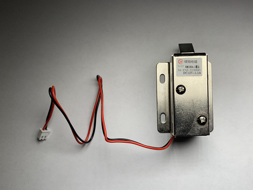

  * 15 Male-To-Male Jumper Wires

  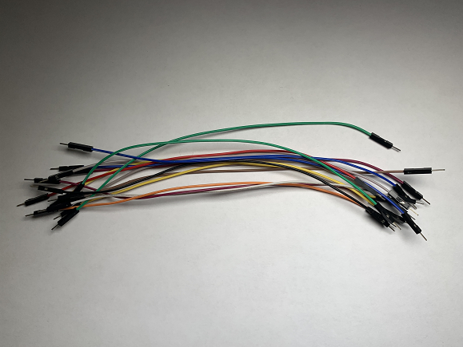

  * 11 Male-To-Female Jumper Wires

  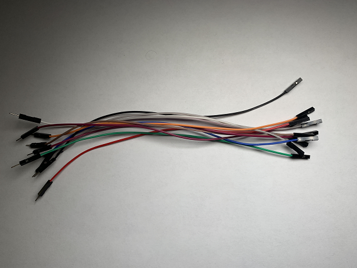

  * Solderless Breadboard *(The smaller, the better)*

  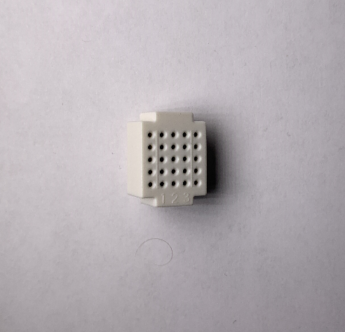

  * Serial-To-USB Cable

  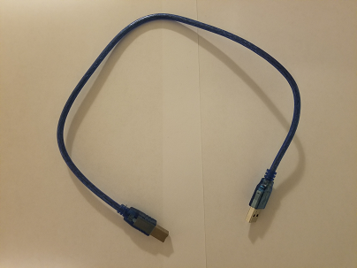

  * *Optional*: Lock Unit Case

  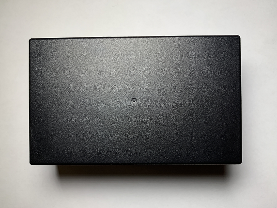

  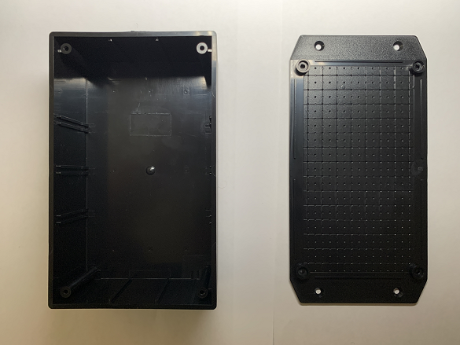

* Other Components

  * RFID Tags

  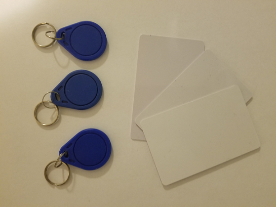

  * Windows Computer

## Software

* Arduino IDE

* Python

  * Libraries:

    * MySQL Connector

    * pySerial

    * ZeroMQ

    * tkcalendar

    * Pillow

* MySQL Server

* *Optional*: Python-Compatible IDE

---

# Instructions

## Setting Up

## *Hardware*

1. Ensure that the following materials are on hand:

    * Arduino Mega

    * RFID Scanner

    * Keypad

    * LCD I2C Display

    * Relay

    * 9-Volt Power Adaptor

    * Solenoid Lock

    * Male-To-Male Jumper Wires

    * Male-To-Female Jumper Wires

    * Solderless Breadboard

2. Connect the RFID Scanner to the Arduino Meg

    * Take 7 Male-To-Female Jumper Wires

    * Insert the Female ends of the Wires into the RFID Scanner's pins

      * The IRQ connection will not be used; you do not have to attach a wire to that connector

      * It is recommended that a empty plug is placed on the IRQ pin so as to cover it from the elements

    * Plug in the Male ends of the wires into the Arduino in the following configuration:

      | RFID | Arduino |
      | :-: | :-: |
      | SDA | 9 |
      | SCK | 52 |
      | MOSI | 51 |
      | MISO | 50 |
      | IRQ | *N/A* |
      | GND | GND |
      | RST | 8 |
      | 3.3V | 3.3V |

3. Connect in the Keypad to the Arduino Mega

    * Take 8 Male-To-Male Jumper Wires

    * Insert one end of the wires into the Keypad's plugs

    * Plug in the other end of the wires into the Arduino in the following configuration:

      | Keypad | Arduino |
      | :-: | :-: |
      | 1 | 49 |
      | 2 | 47 |
      | 3 | 45 |
      | 4 | 43 |
      | 5 | 41 |
      | 6 | 39 |
      | 7 | 37 |
      | 8 | 35 |

4. Connect the LCD I2C Display to the Arduino Mega

    * Take 4 Male-To-Female Jumper Wirers

    * Take 1 Breadboard

    * Plug in the Female ends of the Wires into the 4 I2C pins located on the back of the LCD Display

    * Connect the VCC wire into the Breadboard

    * Plug in the Male ends of the remaining Wires into the Arduino in the following configuration:

      | LCD I2C | Arduino |
      | :-: | :-: |
      | GND | GND |
      | SDA | 20 SDA |
      | SCL | 21 SCL |

5. Connect the Relay to the Arduino Mega

    * Take 5 Male-To-Male Jumper Wires

    * Loosen the Screws on the Relay's connections

    * Insert one end of the wires into the plugs on the relay

      * The NC Connection will not be used, therefore you do no have to plug in any connector

    * Tighten the screws to secure the connection

    * Insert the DC+ wire into the breadboard so as to connect it to the VCC wire from the LCD I2C Display

    * Insert the other ends of the remaining wires into the Arduino in the following configuration:

      | Relay | Arduino |
      | :-: | :-: |  
      | DC- | GND |
      | Out | A1 |

6. Connect the Breadboard to the Arduino Mega

    * Insert one end of a Male-To-Male jumper wire into the 5V port on the Arduino Mega

    * Insert the other end of the wire into the breadbox so that it is in series with the VCC and DC+ wires

7. Connect the 9V Adapter into the circuit

    * Loosen the Screws on the Adapter's connections

    * Insert the wire connected to the Relay's NO socket into the (-) socket of the Adapter

    * Take a Male-To-Male jumper wire and insert one end into the (+) socket of the Adapter

    * Tighten the screws to secure the connection

8. Connect the Solenoid Lock into the circuit

    * Insert the COM wire on the Relay into the Red Wire of the Solenoid Lock

    * Insert the (+) wire from the 9V Adapter into the Black Wire of the Solenoid Lock

## *Software*

1. Download the Contents of this Git Repository

2. Set up the Arduino Software

    * Download and Install the Arduino IDE

      * <https://www.arduino.cc/en/software>
  
      * Select Windows Win 10 and newer, 64 bits

      * Use the default settings on the installer, unless you wish to install the IDE in a specific location

    * Open up LockCode.ico in the Arduino IDE

    * Plug in the Arduino to your computer via the USB-Serial Cable

    * Select the plugged-in board from the drop-down menu

      

    * Note the name of the COM port

    * Upload the Code to the Arduino Mega

    * *Optional*: Upload the Code to the Second Arduino

3. Set up the Python Software

    * Download and Install Python Version 3.10

      * <https://www.python.org/downloads/release/python-3108>

      * The 64-bit Windows installer is recommended

    * At the set up page, check the "Add python.exe to PATH" option and click "Install Now"

      

    * Once Python has been successfully installed, open up the command prompt

    * In the command prompt,run the command "python -m pip list"; you should see a list of the currently installed Python packages if the installation was successful

    * If an new release of pip is available, run the indicated command

    * Run the following command to install the necessary Python packages: "python -m install pyserial zmq tkcalendar pillow

4. Set up the MySQL Software

    * Download and Install the MySQL Installer

      * <https://dev.mysql.com/downloads/installer>

    * Open MySQL Installer if it does not automatically open

    * When prompted to choose a setup type, select "Custom"

     

    * Select the following products to be installed

      * MySQL Server (Latest Edition)

      * MySQL Workbench (Latest Edition)

      * Connector/Python (Latest Edition)

     

    * Install the packages

    * When Configuring the MySQL Server, follow these instructions for each screen

      * Type and Networking: Leave as default

      * Authentication Method: Leave as Default

      * Accounts and Roles: Enter in a root password; this will be needed for later use

      * Windows Service: Leave as Default

      * Server File Permissions: Leave as Default

    * Click execute to set up the MySQL Server

5. Prepare the Database

    * Open up MySQL Workbench and connect to the newly installed server

    * Open up DatabaseSetUp.sql

    * Execute the Script

    * Close MySQL Workbench

6. Prepare the Python Code

    * Open up EverEyePassiveLock1.py in your editor of choice

    * In the definition connectToDatabase(), add in your chosen MySQL username and password

      * These will be on lines 9 & 10

      * If you did not specify a username during setup, the username will be "root"

    

    * Move down to line 110 and type in the port name see in the Arduino IDE where indicated

    

    * Perform the same for EverEyePassiveLock2.py if you've assembled a second lock

       * The port name will be different for the second lock; make sure you do not accidentally copy the same port name

    * Open up EverEyeProgram.py in your editor of choice

    * In the definition connectToDatabase(), add in your chosen MySQL username and password

      * These will be on lines 16 & 17

      * If you did not specify a username during setup, the username will be "root"

    

## *Packaging*

***Placeholder***

---

## Running

Included in the code repository is a Python program titled "RunAll." You may run this to run both passive lock programs as well as the GUI program all at once. You may otherwise run each program as the need arises.

## *Lock Unit*

1. Ensure that the lock unit is running correctly

    * Plug in the lock unit(s) to the computer system that has the MySQL Database installed

    * Run the EverEyePassiveLock program related to the lock unit(s) connected

2. Wave a RFID tag that has been registered and authorized for the lock near the RFID Scanner

    * If the RFID tag has not been registered, the LCD will display a message saying so, a log will be entered into database, and the lock unit will return to its default state

    * This will also happen if the RFID has been registered, but was not authorized for the lock in question

3. When prompted, enter in the password associated with the RFID tag scanned and press # to submit

    * If the password entered does not match the password associated with the RFID tag scanned, the LCD will display a message saying so, a log will be entered into database, and the lock unit will return to its default state

4. If the password is correct, the LCD will state that the lock is open, which it will be for about 5 seconds.

    * Once that time  elapses, the lock will close and the lock will return to its default state

    * A log will be entered into the database that states the entry was successful

## *GUI Program*

### *Log-In Screen*

1. Run the Python program "EverEyeProgram.py"

2. At the Log-In screen, enter in the password **Dolphins** and press *Submit*

3. When you've successfully logged in, you will be greeted with the following menu:

   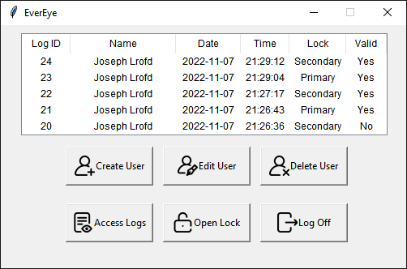

4. Press one of the six available buttons to proceed to that screen

### *Create User*

1. When you press **Create User**, you will see the following screen:

   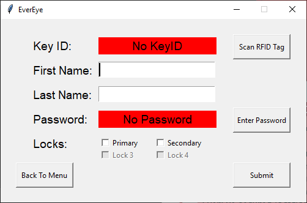

2. Press the *Scan RFID Tag* button to scan in the new User's RFID tag

      * This will prompt the primary lock to scan for a RFID tag

3. Enter in the new User's first name in the next entry box

4. Enter in the new User's last name in the next entry box

5. Press the *Enter Password* button to enter in the new User's Password

      * This will prompt the primary lock to activate the keypad

      * Enter in the password and press # to submit

        * The password must be at least 6 characters long

6. Check the locks that the user will have access to

7. Press *Submit* to create the new user

      * A pop-up window will appear saying that the user was successfully created

        * Press *Confirm* to return to the Main Menu

      * If something went wrong, a pop-up window will appear and state what happened

        * Press *Confirm* to return to the **Create User** screen

### *Edit User*

1. When you press **Edit User**, you will see the following screen:

    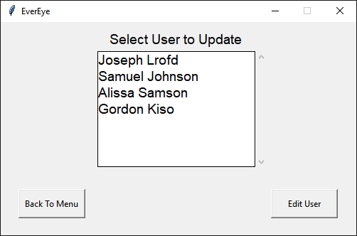

2. Select the User you wish to edit and press **Edit User**

3. You will be taken to the **Create User* Screen, but with the existing User's information already filled

4. See the **Create User** section for more information

### *Delete User*

1. When you press **Delete User**, you will see the following screen:

    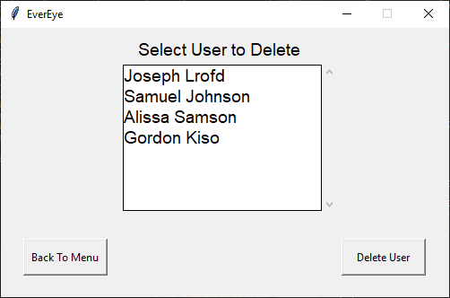

2. Select the User you wish to delete and press **Delete User**

3. A pop-up window will appear asking you to confirm the delete; press **Yes** to delete the User

### *Access Logs*

1. When you press **Access Logs**, you will see the following screen:

    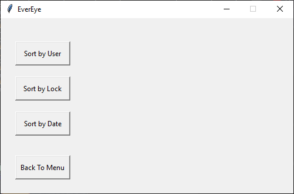

2. Select the parameter you wish to sort the logs by

3. If **User** was selected, you will see a list of Users as shown below:
  
     * Select the user you wish to see the logs for and press **Show Logs**

     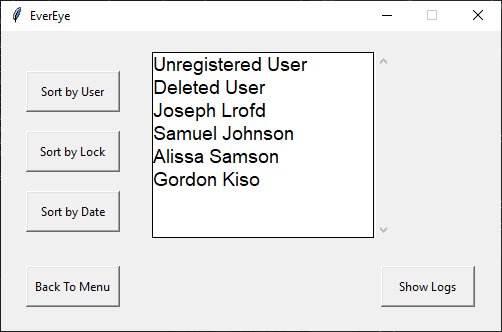

4. If **Lock** was selected, you will see a list of Locks as shown below:
  
     * Select the lock you wish to see the logs for and press **Show Logs**

     

5. If **Date** was selected, you will see a calendar as shown below:
  
     * Select the date you wish to see the logs for and press **Show Logs**

     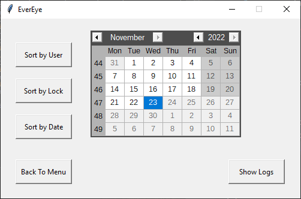

6. Regardless of the filter you have chosen, you will be taken to a screen that shows the requisite logs, as seen below:

      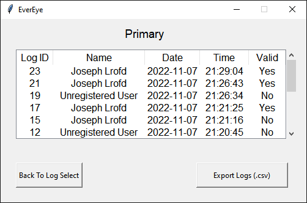

7. To export the current list of logs, Press the **Export Logs** button

    * You will see a pop-up menu where you can type in the name of the file you wish to create

    * Press **Export** to export the list of logs to the "Logs" folder as a .csv file

### *Open Lock*

1. When you press **Open Locks**, you will see the following screen:

    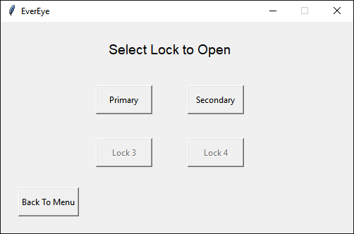

2. Select the Lock that you wish to open to open the lock for 5 seconds

    * Make sure that the lock you are selecting is connected

    * If the lock is not connected, the program will freeze up as it tries to communicate with it

### *Log Off*

* This will lead you back to the log-in screen

* Go to that section for instructions

---

# Future Improvements

There are many improvements that, given the time and resources, I would like to implement into this project. They have been sorted in order of assumed priority:

* Replace the Serial connection with a more robust and versatile protocol
  * This would likely make other improvements possible, if not easier
  * Would likely require an external connection module for the Arduino, as well as a dedicated power supply, rather than the Serial-to-USB connection currently used
* Allow for dynamic addition and removal of lock units
  * Right now, the GUI is designed to detect and acknowledge 2 different locks
  * In order to add additional locks, the code of the GUI must be modified
  * Replacing the Serial connection currently used will likely make this easier to implement
* Improve the filtering capability of the GUI program in regards to logs
  * There are currently only 3 filters: lock, user, and time
  * Allowing for the inclusion of sub-filters would make organizing large amounts of data more manageable
* Add in wireless capability to the lock unit
  * This would allow the lock unit to communicate with both the physical lock and the server without needing a physical connection to either
  * This would greatly improve the usability of the security suite
  * Such capability would also come with a need for greater security in terms of the code itself

# Authors

Designed by Alexander James Tolley

Icons by Freepix: <https://www.flaticon.com/authors/freepik>

# Acknowledgments

I would like to thank my Capstone Advisor, Professor Jason Isaacs, for his assistance and advice during the creation of this project. He has provided invaluable aid both in the formulation of this project and its design, including providing many of the hardware components that make up the lock unit as well as emphasizing the multi-lock functionality and lock export capability of the security suite.

I would also like to thank my former Capstone Advisor, Professor Reza Abdolee, for initially taking me on for the Capstone Project and recommending me Professor Jason Isaacs as a better fit for my expertise.

Finally, I would like to thank all of my other professor that I've had during my time at California State University Channel Islands. It is thanks to you all that I was able to reach this point.
